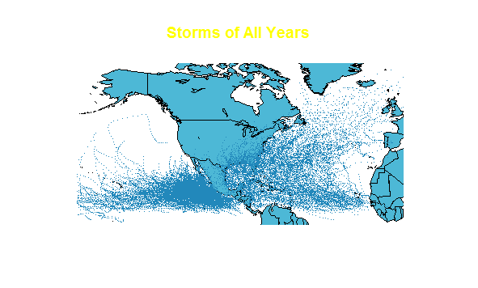
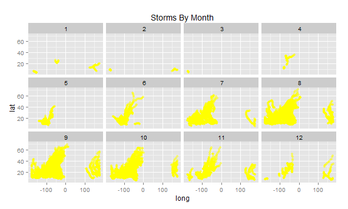
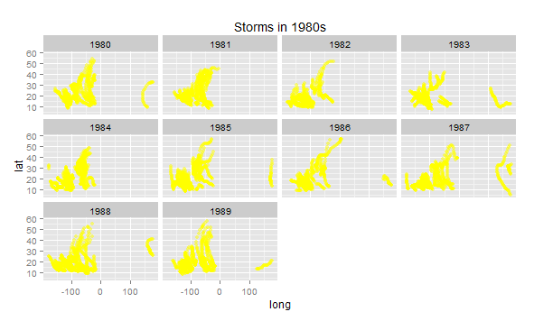
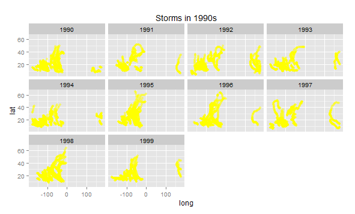
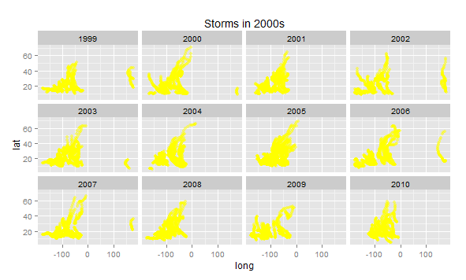

From our analysis we discovered that storms happen more frequently in the fall months. We also confirmed that as expected there are more storms at slower wind speeds.

We also used a linear regression model to fit the trend between the average wind speed in a storm, and the average pressure. We discovered that higher wind speeds indicate lower pressure, meaning there is a negative correlation between the two.

Using graphics, we plotted the trajectories of all the storms in the data set.

We also plotted the trajectories of each storm in a year, divided up by month. This helped us see which months had the most and longest storms.

Lastly, we plotted the storms by year for each decade, to see which years were storm-heavy for each decade.

storms in 1980s:

storms in 1990s:

storms in 2000s:

